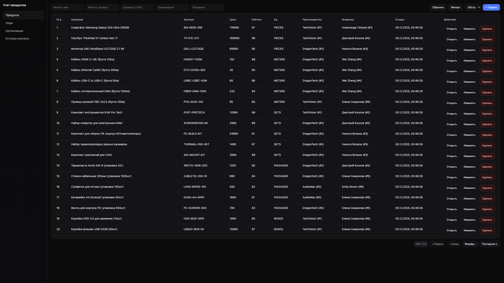
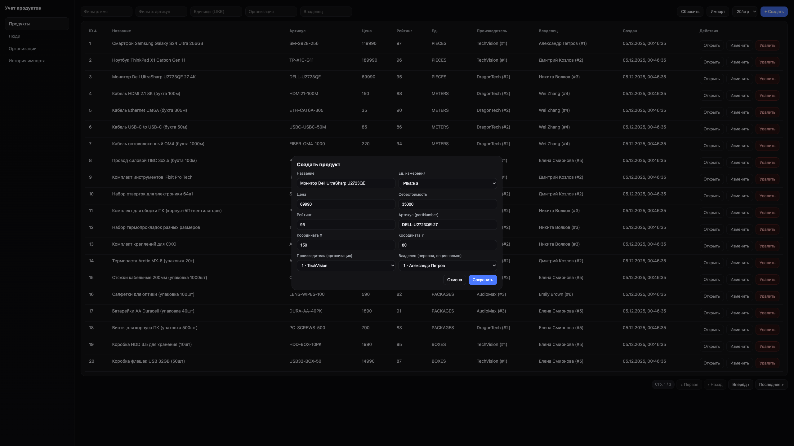
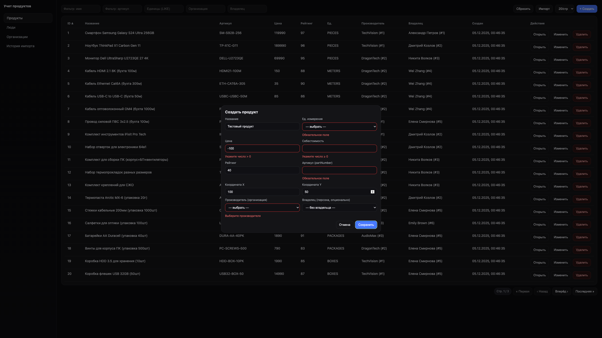
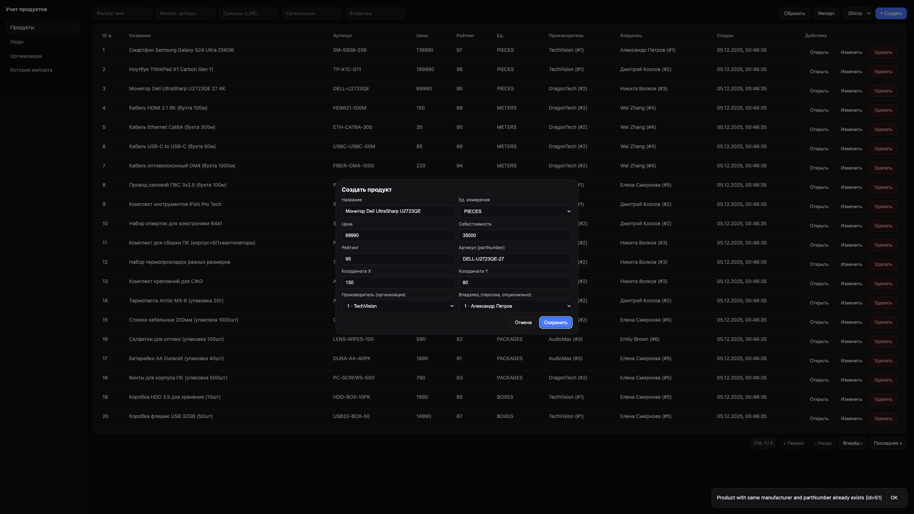
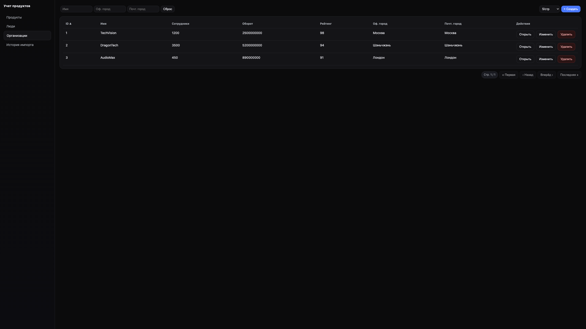
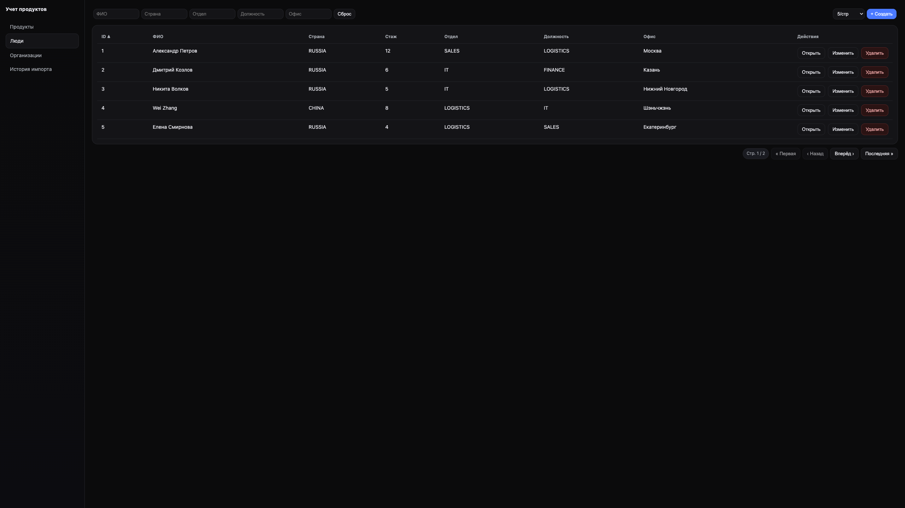
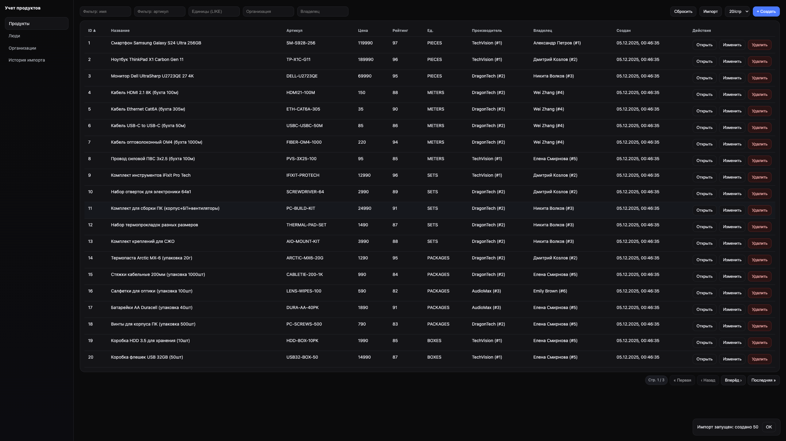
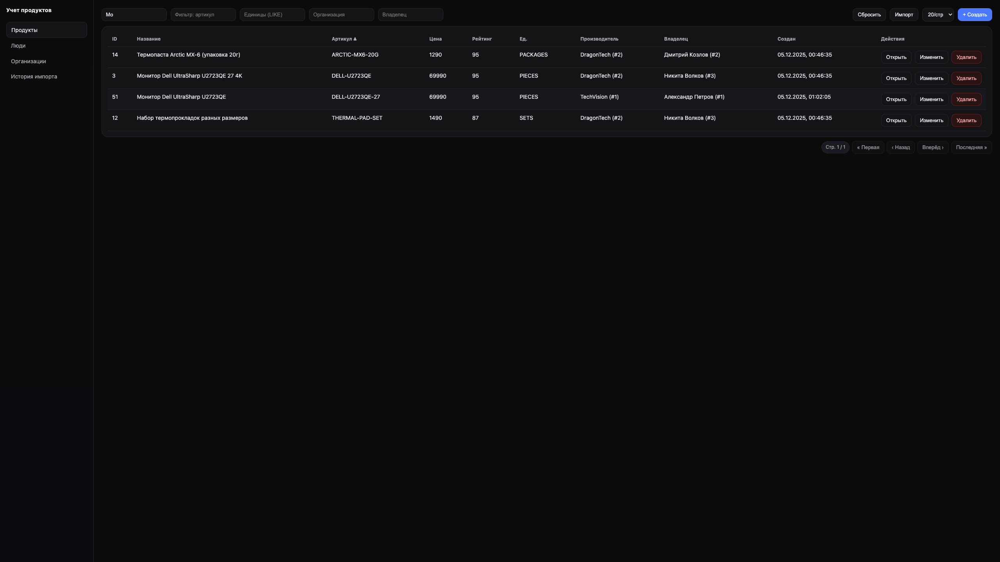

<div align="center">

# 📦 Product Inventory

**Product, Organization & Personnel Management System**

[](https://openjdk.org/) [](https://spring.io/) [](https://hibernate.org/) [](https://postgresql.org/) [](https://react.dev/)

<br/>

*Business-oriented platform for product catalog management,*  
*supplier data storage, and bulk product import*

<br/>

[Features](#-features) •
[Screenshots](#-screenshots) •
[Getting Started](#-getting-started) •
[API](#-api)

</div>

---

## 🌟 Features

<table>
<tr>
<td width="50%">

### 📦 Product Management
- Full CRUD with validation
- Relations: Product → Manufacturer → Owner  
- Unique constraint by part number + manufacturer
- Data normalization on save

</td>
<td width="50%">

### 📥 Bulk Import
- Upload from JSON files
- Atomic transactions (all or nothing)
- Auto-creation of related entities
- Operation history with statuses

</td>
</tr>
<tr>
<td width="50%">

### 🔍 Filtering & Sorting
- Search by any field
- Sort by clicking column header
- Flexible pagination
- Settings persistence

</td>
<td width="50%">

### 🔔 Real-time Updates
- WebSocket notifications
- Auto-refresh on changes
- Cross-tab synchronization
- Instant feedback

</td>
</tr>
</table>

---

## 📸 Screenshots

<div align="center">

### Product Catalog



<br/>

### Create Product



<br/>

### Data Validation

<table>
<tr>
<td width="50%" align="center">



**Client-side Validation**

</td>
<td width="50%" align="center">



**Server Business Rules**

</td>
</tr>
</table>

<br/>

### Organizations & Personnel

<table>
<tr>
<td width="50%" align="center">



**Organization Management**

</td>
<td width="50%" align="center">



**Personnel Management**

</td>
</tr>
</table>

<br/>

### Data Import

<table>
<tr>
<td width="50%" align="center">



**Import Result**

</td>
<td width="50%" align="center">


**Operation History**

</td>
</tr>
</table>

<br/>

### Filtering & Sorting

<table>
<tr>
<td width="50%" align="center">


**Field Filtering**

</td>
<td width="50%" align="center">



**Sort by Part Number**

</td>
</tr>
</table>

</div>

---

## 🚀 Getting Started

### Requirements

  

### Backend

```bash
cd backend
mvn clean package
```

> ⚙️ Configure JNDI DataSource `java:/ProductInventoryDS` in your application server

### Frontend

```bash
cd frontend
npm install
npm run dev       # → http://localhost:5173
npm run build     # Production build
```

---

## 📡 API

<details>
<summary><b>Products</b> — product management</summary>

| Method | Endpoint | Description |
|:------:|----------|-------------|
| `GET` | `/product` | List with filtering |
| `GET` | `/product/{id}` | Get by ID |
| `POST` | `/product` | Create |
| `PUT` | `/product/{id}` | Update |
| `DELETE` | `/product/{id}` | Delete |

</details>

<details>
<summary><b>Organizations</b> — organization management</summary>

| Method | Endpoint | Description |
|:------:|----------|-------------|
| `GET` | `/organization` | List |
| `GET` | `/organization/{id}` | Get by ID |
| `POST` | `/organization` | Create |
| `PUT` | `/organization/{id}` | Update |
| `DELETE` | `/organization/{id}` | Delete |

</details>

<details>
<summary><b>Persons</b> — personnel management</summary>

| Method | Endpoint | Description |
|:------:|----------|-------------|
| `GET` | `/person` | List |
| `GET` | `/person/{id}` | Get by ID |
| `POST` | `/person` | Create |
| `PUT` | `/person/{id}` | Update |
| `DELETE` | `/person/{id}` | Delete |

</details>

<details>
<summary><b>Import</b> — bulk import</summary>

| Method | Endpoint | Description |
|:------:|----------|-------------|
| `POST` | `/import/products` | Upload file |
| `GET` | `/import-history` | Operation history |

</details>

<details>
<summary><b>WebSocket</b> — real-time notifications</summary>

| Endpoint | Description |
|----------|-------------|
| `/ws` | STOMP WebSocket |
| `/topic/changes` | Subscribe to changes |

</details>

---

## 📂 Project Structure

```
ProductInventory/
│
├── 📁 backend/
│   ├── pom.xml
│   └── src/main/java/ru/productinventory/
│       ├── config/        # Spring, Hibernate, WebSocket
│       ├── controller/    # REST API
│       ├── service/       # Business logic
│       ├── repository/    # Data access
│       ├── model/         # Entities
│       ├── dto/           # Transfer Objects
│       ├── mapper/        # DTO ↔ Entity
│       └── ws/            # WebSocket
│
└── 📁 frontend/
    ├── package.json
    └── src/
        ├── api/           # HTTP/WS clients
        ├── components/    # UI components
        └── pages/         # Pages
```
